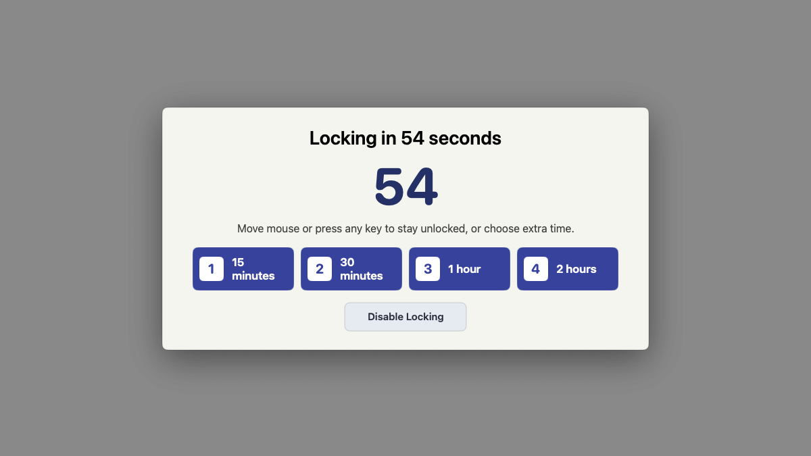
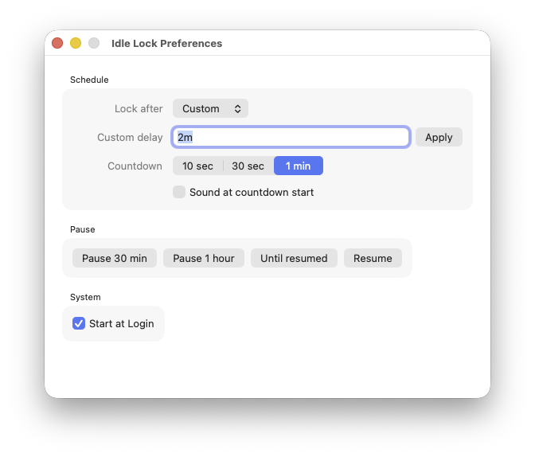
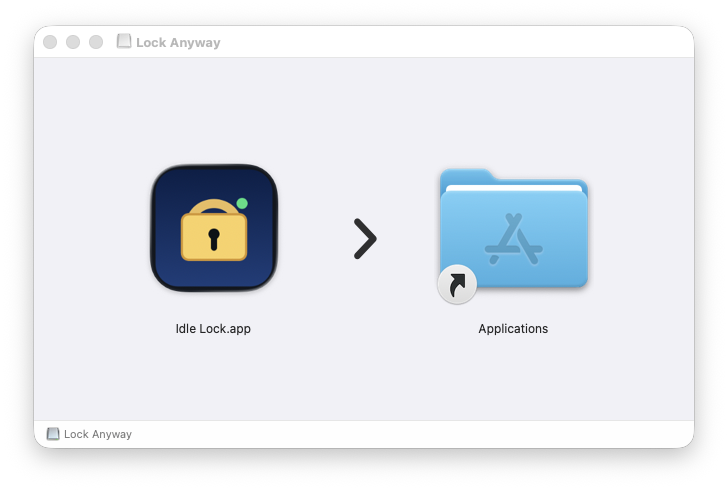

# Lock Anyway

Lock Anyway is a native macOS menu bar utility that locks the local Mac after real keyboard and mouse inactivity, even when media playback, remote desktop, or a single misbehaving process keeps the display awake.

The app is currently implemented under the bundle name **Idle Lock** (`com.user.IdleLock`) to keep Accessibility permission stable across development builds.

## Screenshots



| Preferences | DMG installer |
| --- | --- |
|  |  |

## What It Does

- Reads real HID idle time from `IOHIDSystem`.
- Shows a visible countdown before locking.
- Lets the user add time from the countdown panel: 15 minutes, 30 minutes, 1 hour, or 2 hours.
- Cancels the countdown immediately on keyboard or mouse activity.
- Locks with `CGSession -suspend` when available, otherwise uses the native `Control-Command-Q` shortcut with Accessibility permission.
- Starts at login through a user LaunchAgent with crash restart behavior.

## Recommended Name

Product name: **Lock Anyway**

Tagline: **Apps can keep your Mac awake. Not unlocked.**

The important product promise is not the grace period itself; it is that one app should not leave the Mac unlocked all day.

## Install

For a normal user, build the DMG:

```sh
scripts/package-dmg.sh
```

Then open:

```text
dist/LockAnyway-1.0.dmg
```

Drag `Idle Lock.app` to Applications, then open it from `/Applications`. The app intentionally refuses to run from the mounted disk image so Start at Login and Accessibility permission stay attached to the installed copy.

For managed installs, build the signed package:

```sh
scripts/package-app.sh
```

Then open the package in Finder:

```text
dist/IdleLock-1.0.pkg
```

The current package installs:

- App: `/Applications/Idle Lock.app`
- LaunchAgent: `~/Library/LaunchAgents/com.user.idle-lock.plist`
- Log: `~/Library/Logs/IdleLock.log`

On first launch, grant Accessibility permission when prompted. Modern macOS needs that permission so the app can send the native lock shortcut when `CGSession` is unavailable.

See [docs/INSTALL.md](docs/INSTALL.md) for the full install and permission flow.

## Development

Build only:

```sh
scripts/build-app.sh
```

Test:

```sh
swift run IdleLockSelfTest
```

Reload after app changes:

```sh
scripts/reload-app.sh
```

The canonical development install location is `/Applications/Idle Lock.app`. Do not run a second copy from `.build` or `~/Applications`; duplicate app paths can confuse macOS Accessibility permission.

See [docs/DEVELOPMENT.md](docs/DEVELOPMENT.md) for build, test, package, and reload details.

## Manual Verification

1. Run `scripts/reload-app.sh`.
2. Confirm the running app path is `/Applications/Idle Lock.app/Contents/MacOS/IdleLock`.
3. Set a short custom delay such as `30s` and countdown warning `10 sec`.
4. Confirm the overlay appears over fullscreen content, mouse/key activity cancels it, add-time buttons work, and the countdown reaches lock.
5. Confirm RustDesk or other remote access stays connected while the local Mac locks.

## Documentation

- [Product and naming](docs/PRODUCT.md)
- [Install guide](docs/INSTALL.md)
- [Development guide](docs/DEVELOPMENT.md)
- [Troubleshooting](docs/TROUBLESHOOTING.md)

## Old Watchdog Migration

Keep `com.user.idle-lock-watchdog` enabled until the native app is verified. After verification:

```sh
scripts/disable-old-watchdog.sh
```

The old script at `/Users/t/.local/bin/idle-lock-watchdog` is left on disk for rollback.

## Distribution Note

When Developer ID certificates are available in the keychain, `scripts/build-app.sh` signs the app with `Developer ID Application` and `scripts/package-app.sh` signs the package with `Developer ID Installer`. Notarization is still required for broad distribution outside this machine.
